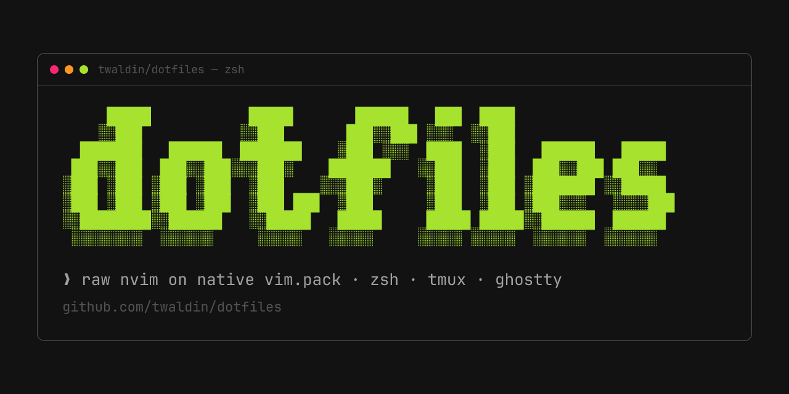

# dotfiles



my dotfiles: raw nvim on native vim.pack, zsh, tmux, Ghostty, native macOS window management, and SketchyBar.

## what's inside

| dir | what |
|-----|------|
| `nvim/` | raw neovim config in lua — plugins via native `vim.pack`, native `vim.lsp` |
| `zsh/` | zshrc + oh-my-posh prompt (`pure-modified.omp.json`) |
| `tmux/` | tmux.conf — `C-space` prefix, vi mode, tpm + resurrect + continuum |
| `terminal/ghostty/` | Ghostty config — Hardcore theme, JetBrains Nerd Font |
| `yabai/` + `skhd/` | recursive native-Space BSP, guarded activation, signed Accessibility wrappers |
| `aerospace/` | inactive, reversible window-manager fallback |
| `sketchybar/` | pinned SbarLua bar, static calendar status, supported status and control surfaces |
| `scripts/` | tmux-sessionizer, Ghostty base16 theme switcher, Claude statusline |
| `zen/` | zen browser userChrome.css + mods export |

## nvim

no distro, no lazyvim — plain lua loaded from `init.lua`.

- plugins managed by neovim's built-in `vim.pack` (nightly), pinned in `nvim-pack-lock.json`: base16-nvim, oil, fzf-lua, blink.cmp, mason, treesitter (main), gitsigns, mini.icons, nabla, typst-preview
- native `vim.lsp` — one config file per server under `nvim/lsp/`, servers installed via mason
- colorscheme is base16-nvim, auto-synced from ghostty — `theme.lua` reads `~/.config/ghostty/config`, maps the ghostty theme to its base16 scheme, then strips backgrounds for transparency
- completion: blink.cmp (super-tab); pickers: fzf-lua for files/grep/lsp/git; files: oil.nvim
- vendored lasso.nvim for harpoon-style file marks — `<leader>H` to mark, `<leader>1..9` to jump
- leader is space; keymaps in `nvim/lua/keybinds.lua`

## usage

no install script — symlink what you want into place:

```sh
ln -s "$PWD/nvim"                        ~/.config/nvim
ln -s "$PWD/zsh/zshrc"                   ~/.zshrc
ln -s "$PWD/zsh/pure-modified.omp.json"  ~/pure-modified.omp.json
ln -s "$PWD/tmux/.tmux.conf"             ~/.tmux.conf
ln -s "$PWD/terminal/ghostty/config"     ~/.config/ghostty/config
ln -s "$PWD/yabai"                       ~/.config/yabai
ln -s "$PWD/skhd"                        ~/.config/skhd
ln -s "$PWD/aerospace"                   ~/.config/aerospace
ln -s "$PWD/sketchybar"                  ~/.config/sketchybar
ln -s "$PWD/scripts"                     ~/scripts
mkdir -p "$HOME/Library/LaunchAgents"
ln -sfn "$PWD/yabai/launch-agents/com.asmvik.yabai.plist" "$HOME/Library/LaunchAgents/com.asmvik.yabai.plist"
ln -sfn "$PWD/yabai/launch-agents/com.koekeishiya.skhd.plist" "$HOME/Library/LaunchAgents/com.koekeishiya.skhd.plist"
```

tmux plugins need [tpm](https://github.com/tmux-plugins/tpm); nvim pulls its own plugins on first launch.

The window-manager slice targets Apple-silicon macOS Tahoe. The checked-in launch agents use the macOS short name `twaldin`. For a different account, first replace every wrapper and log path in both plists with that account's absolute paths, then run `plutil -lint` on both files. The activation script rejects paths that do not match the current account or fixed platform prerequisites.

The window-manager lifecycle fails closed. On first Home adoption, stop the old yabai/skhd jobs, back up and remove prior launch-agent symlinks, and back up and remove the prior real `~/.config/{yabai,skhd,aerospace}` directories. Create native Spaces 1 through 9 on primary display 1 (external displays may have additional Spaces), publish only reviewed app bundles, run `/usr/bin/python3 -I yabai/deploy-lifecycle.py prepare --adopt-existing`, attest the exact Accessibility approvals, and then run its `activate` action. Use the same module's `rollback` action for guarded fallback. Never run both window managers together.

Install SketchyBar dependencies with `sketchybar/install-deps.sh`, run `sketchybar/scripts/smoke-config.sh`, and reload only after both pass. See `sketchybar/OPERATIONS.md` for permissions, runtime checks, and rollback.

terminal theme is Ghostty's `Hardcore` — nvim follows it automatically.
